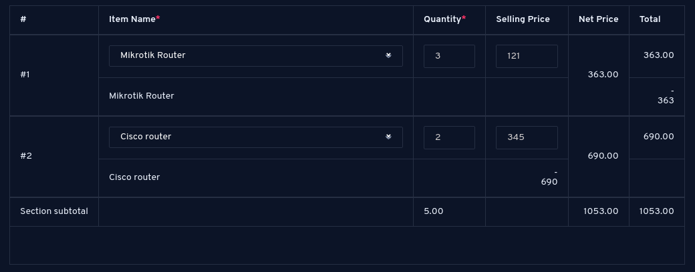

# MITS Vue.js Assessment

## The challenge
Your challenge is to build a Vue.js Item Line component that loads a list of products from the API and let the users select which products they want in how many quantities. It'll calculate the cost of each item and all of the selected items based on the price and quantity fields.

After this, you should be able to submit your data with axios to an endpoint, altough we don't have one right now. 

## Preview
Here's a suggested layout that contains necessary fields:

## API
You can find a mock API that contains products here: https://fakestoreapi.com/products

## Note
Remember to ask your questions(if you have any) before starting the assessment. Make sure it's clear for you what is the input and what is the output of your work.

## Process
You should clone this repository and start your work from there. When you're done add the manual on how to install and run your project to the getting-started.md file and when you're done, submit a merge request to this repository. 
